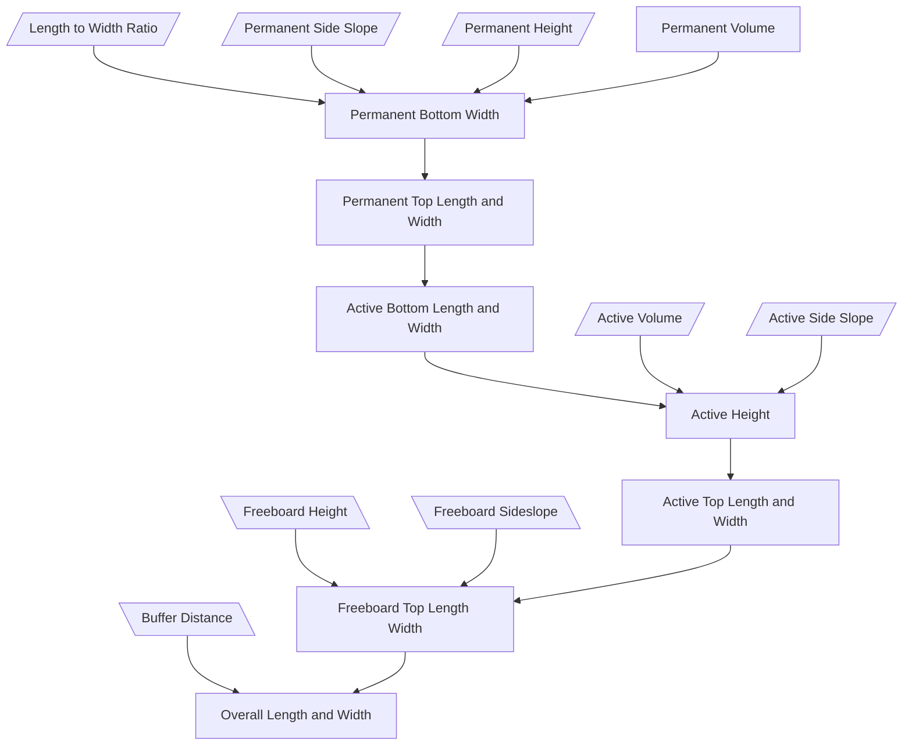
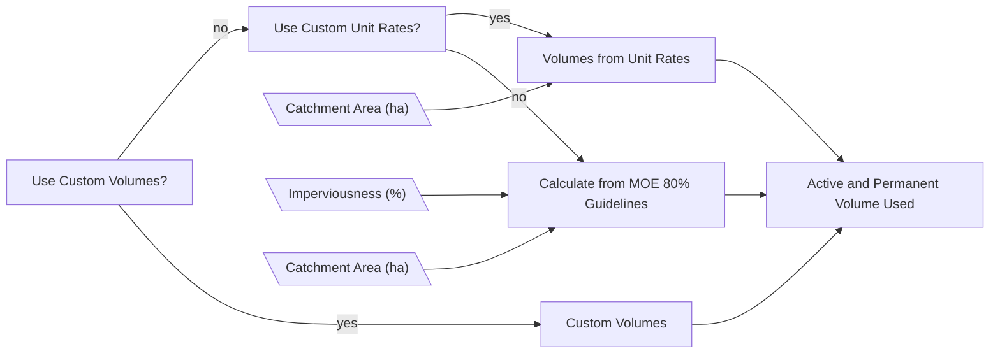

# Pond Calculator

Consists of

<!-- $$
V_{truncated} = \frac{1}{6}h(a_{base}+(a+c)(b+d)+a_{top})
$$

where

- $a_{base}:$ area of base
- $a_{top}:$ area of top

$$

\\
a_{base} = a \times b

\\
a_{top}  = c \times d

\\

c = a + 2hs

\\

b = q x a

$$ -->
